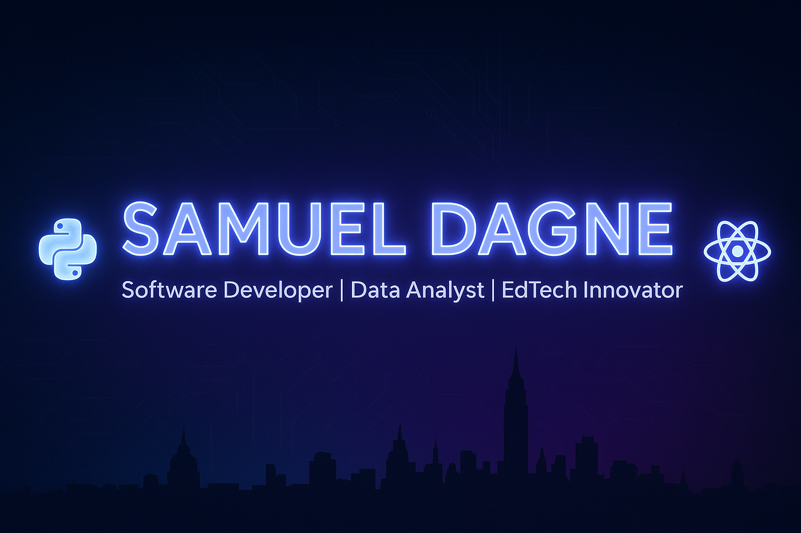

  

# *👋 Hey there, I'm Samuel Dagne*  

💻 **Software Developer** | 📊 **Data Analyst** | 🚀 **EdTech Innovator** | **Full Stack Developer**
🌍 Based in **Addis Ababa, Ethiopia 🇪🇹**  
⚡ Currently crafting impactful solutions at **Chereka Tech**  

---

## 🌟 About Me  

I’m a **technologist** passionate about building tools that connect **education, data, and technology**.  
My mission is to **empower schools and communities** through smart, practical, and scalable software solutions.  

✨ A glimpse of what I do:  
- 💻 **Programming:** Python, JavaScript, C++, SQL  
- 📊 **Data Science & Visualization:** Pandas, NumPy, Plotly, Matplotlib, scikit-learn  
- 🏫 **EdTech Projects:** School Management Systems, LMS, Digital Learning Platforms  
- 🌍 **Impact-Driven Work:** Leveraging technology to solve local challenges  

---

 

### **Languages & Frameworks**

### **Data Science & Visualization**

### **Cloud & DevOps**

### **Creative & Productivity**

---

## 📂 Featured Projects  

🚀 [**Chereka School System**](#) – Complete school management with analytics.  
📘 [**EduTrack**](#) – Lightweight LMS tailored for African schools.  
📊 [**Data Insights Dashboard**](#) – Interactive dashboards using Plotly & Python.  
🤖 [**AI Study Helper**](#) – An AI assistant for learners.  

---

## 📊 GitHub Performance  

  
  

  

---

## 🏆 Contributions & Achievements  

---

## ✍️ Wisdom for Developers  

---

## 🌐 Connect With Me  

